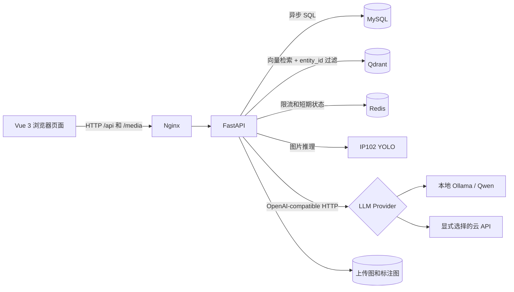
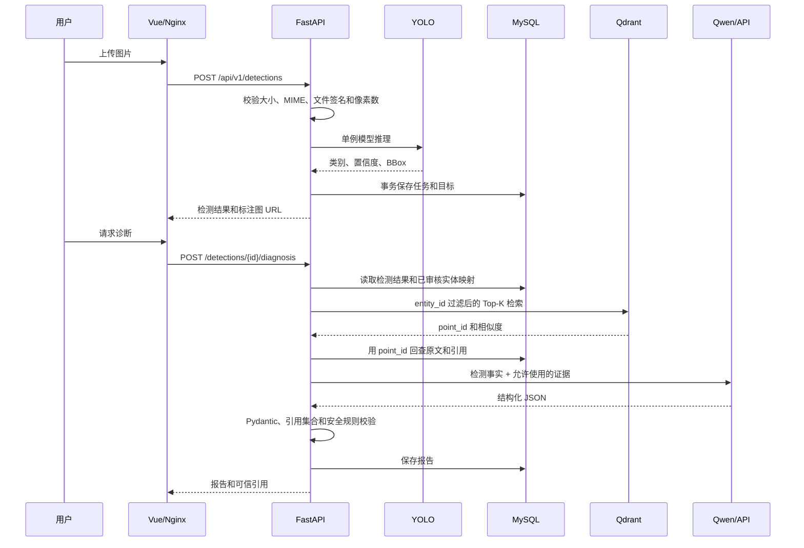
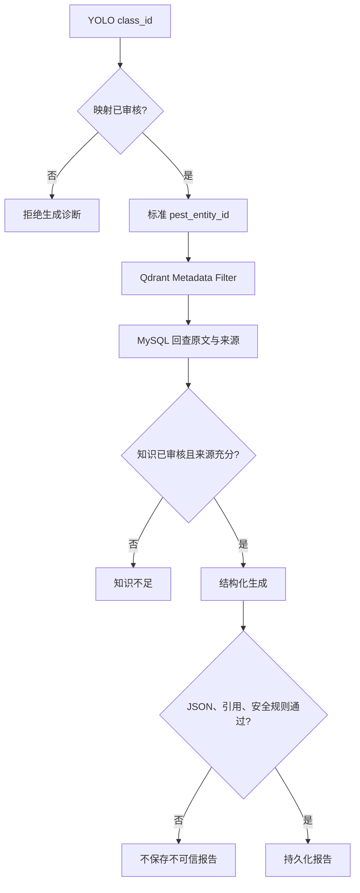

# AgriGuard AI 系统架构

## 1. 项目边界

AgriGuard AI 当前聚焦 IP102 农业害虫目标检测，不包含植物病害模型。系统把三类结果明确分开：

1. YOLO 给出的检测框、原始类别、置信度和数量。
2. MySQL 与 Qdrant 返回的已审核知识和来源。
3. 大语言模型基于本次检索证据生成的结构化总结。

大语言模型不能修改检测结果，也不能自行构造引用。

## 2. 运行架构

Nginx 是浏览器唯一入口。Vue 使用相对地址访问 `/api` 和 `/media`，因此 API Key 不会进入前端，开发和生产也能使用相同 URL。

## 3. 一次检测请求

## 4. 后端分层

| 层 | 责任 | 不应承担的责任 |
|---|---|---|
| API Router | HTTP 参数、状态码、响应模型 | SQL、YOLO 输出解析 |
| Service | 业务流程、事务边界、状态机 | FastAPI 路由细节 |
| Repository | SQLAlchemy 查询和持久化 | 业务决策 |
| Predictor | 模型加载、推理、后处理 | 数据库写入 |
| RAG | 解析、切块、Embedding、过滤检索 | 自由生成答案 |
| LLM Provider | 统一模型调用、超时和重试 | 自动选择云端回退 |
| Schema | 输入输出校验 | ORM 会话管理 |

FastAPI lifespan 只创建一次数据库连接池、Redis、Qdrant 客户端、YOLO、Embedding 和 LLM Provider。关闭应用时按相反顺序释放资源。

## 5. 数据存储职责

- MySQL：检测任务、目标框、模型版本、标准实体、文档、分块关联、审核状态和诊断报告。
- Qdrant：分块向量和用于过滤的 payload，不作为引用正文的唯一事实来源。
- Redis：Agent 请求限流；Redis 不可用时限流接口失败关闭，避免绕过成本保护。
- 文件卷：原图、标注图和本地 Embedding 缓存。

## 6. RAG 可信边界

LangChain Agent 只用于规划跟进问题的检索词。它只有一个只读检索工具，实体范围由检测任务固定；Agent 的自由文本会被丢弃，面向用户的答案由第二次结构化调用生成并校验。

## 7. 模型部署选择

后端镜像有三个累计目标：

- `api`：不安装 PyTorch，适合数据库、接口和云服务联调。
- `rag`：增加本地 sentence-transformer Embedding。
- `full`：再增加 Ultralytics YOLO/PyTorch。

Windows 开发使用 Ollama 运行 Qwen。Linux GPU 服务器可把同一 Provider 地址切换到 vLLM 的 OpenAI-compatible API，RAG 和业务服务无需修改。

## 8. 当前验证状态

- 后端单元/集成测试、Ruff、Mypy 已通过。
- Vue 单元测试和生产构建已通过。
- MySQL、Qdrant、Redis 的已有容器健康。
- 本地 Qwen、真实 YOLO、RAG 诊断和受限 Agent 流程分别完成过真实验证。
- 完整 Nginx + FastAPI 镜像构建仍需在容器仓库 TLS 恢复后执行 `scripts/smoke_deployment.py` 完成最终验收。
